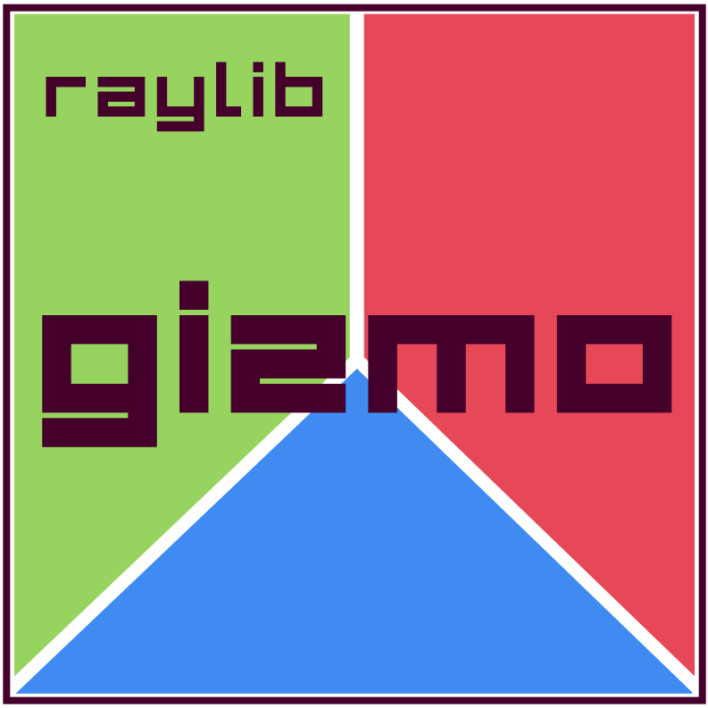
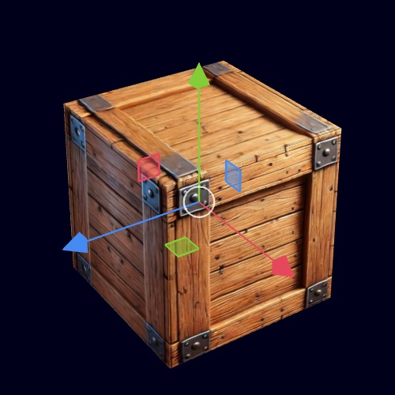

   

> **Note**: This library is in **beta**. Your feedback and support in enhancing its quality are greatly appreciated!

## Introduction

**raylib-gizmo** is a clean and customizable 3D gizmo tool for raylib. Designed with an **Immediate Mode style** for simplicity, it requires just a single function call to draw and interact.  
No dependencies other than raylib: just include `raygizmo.c/.h` in your project, and you're ready to go!

<p align="center">
  
  <!--img src="res/raylib_example_01.gif" alt="raylib-example"-->
</p>

## Table of Contents

- [Core Features](#core-features)
- [Minimal Usage](#minimal-usage)
- [Code Examples](#code-examples)
- [License](#license)
- [Current Limitations](#current-limitations)
- [Credits](#credits)

## Core Features

- **Portable Code:** No dependencies other than raylib.
- **Ease of Use:** Simple and customizable.
- **Flexible Transformations:** Translate, rotate, scale, or any combination of these three together.
- **Orientation Support:** Works with global, local, and view orientations.
- **Immediate-Mode Style:** Just one function call to draw and interact with the gizmo.
- **Camera Independence:** Gizmo size remains consistent regardless of camera movement.
- **raylib Integration:** Leverages raylib's `Transform` structure, eliminating the need for additional data structures.

## Minimal Usage

```c
#include <raygizmo.h>

int main(...) {

    Model model;

    ...

    // Initialize a Transform for the gizmo.
    // This Transform stores translation, rotation, and scaling values,
    // and will be dynamically updated by the gizmo during the program.
    Transform gizmoTransform = GizmoIdentity();
  
    while (...) {
    
        ...

        // Update the model's transform matrix using the gizmo's Transform.
        model.transform = GizmoToMatrix(gizmoTransform);

        // Draw the model with the updated transformation matrix.
        DrawModel(model, Vector3Zero(), 1.0f, WHITE);
    
        // Render a translation + rotation gizmo and handle user input.
        // The gizmoTransform will be directly updated by this gizmo.
        DrawGizmo3D(GIZMO_TRANSLATE | GIZMO_ROTATE, &gizmoTransform);

        ...

    }
}

```

---

## Code Examples

**[`1) example_01_getting_started.c`](https://github.com/cloudofoz/raylib-gizmo/blob/main/examples/gizmo/example_01_getting_started.c)**  
> *Description:* Demonstrates how to integrate and interact with a simple, globally oriented, 3D translation gizmo in a raylib scene.
   <p align="center">
    
   </p>
   
---

## License

This project is licensed under the **Zlib** License. See the [LICENSE](LICENSE.md) file for details.

---

## Current Limitations

| Operation  | Global | Local | View  |
|------------|--------|-------|-------|
| Translate  | Yes    | Yes   | Yes   |
| Rotate     | Yes    | Yes   | Yes   |
| Scale      | No     | Yes   | No    |

For now, every gizmo with a scaling component will operate in local axis orientation. This means that an object will always be scaled as if no other transforms are applied.

---

## Credits

Although many gizmos share a similar appearance, this project drew visual inspiration from the Blender 3D editor. Interacting with Blender's gizmo provided key insights into designing my tool.
